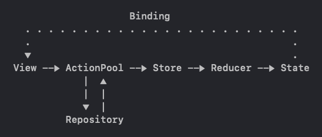

# #мамавыдохни: самоприкорм
#### Модуль проекта [#мамавыдохни](https://github.com/4440449/Mom_Exhale)

В связи с ростом популярности BLW-методики прикармливания (Baby-Led-Weaning) многие родители испытывают потребность в ресурсе, который мог бы предоставить базу знаний по каждому продукту. Продукты имеют свои особенности для подачи, некоторые содержат аллергены, влияют на пищеварение и эта информация важна для родителей. Приложение дает возможность пользоваться базой продуктов, искать нужные продукты, ознакамливаться с информацией о безопасной подаче.

 

## Tech specs
- Redux. Элементы Clean architecture
- Каждый экран выделен в отдельную сцену с необходимым окружением
- DI для каждой сцены со сбокрой через static объект
- Observing Combine
- Network через [собственную библиотеку](https://github.com/4440449/BabyNet)
- Backend - <a href="https://app.supabase.com">Supabase</a>
- SwiftUI
- WebKit
- Dark mode

## Features
    
* Простой, однонаправленный поток данных **по схеме:**
  
    1. View посылает событие в Action Pool передавая при необходимости параметры
    2. Action Pool (также выполняет роль Middleware) делает запросы в репозиторий, обрабатывает полученные данные, заворачивает их в конечный Action и диспачит в Store
    3. Store меняет свой State только через Reducer вызывая его диспач и передавая Action с данными
    4. Reducer switch'ом проходится по Action, достает данные и сетит их в State

* Роль детального экрана выполняет обычная WebView с отключенной возможностью веб серфинга других страниц
             
* Финальный продукт [запакован в SPM](https://github.com/4440449/SamoprikormModule) и инъектися в основной проект, как обычный пакет.  
Практически вся реализация модуля остается приватной для изменений и вызовов из основного проекта. Точка входа - единственный публичный static метод, который возвращает готовую View
       

## TODO
- Возможность сохранять избранные продукты для работы с приложением оффлайн
- In app handling dark mode

## Requirements
iOS 14.0 +  
Xcode 13.2.1 +  
Swift 5 +

# HOW TO USE APP
Для использования приложения требуется наличие интернет-соединения. Данные загружаются автоматически. Для поиска конкретного продукта воспользуйтесь строкой поиска на главном экране. Чтобы узнать подробнее нажмите на карточку интересующего продукта.
 
